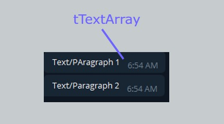
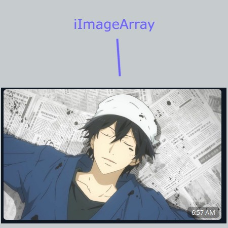
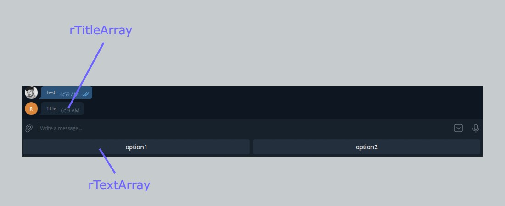
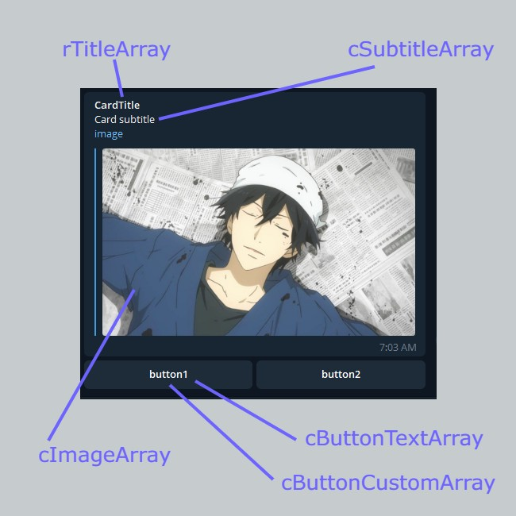

# tgBlocks

import Tabs from "@theme/Tabs";
import TabItem from "@theme/TabItem";

Telegram Blocks help us to display information on Telegram

Telegram Blocks have a Native Integration with Dialogflow, and there are others that uses external Payloads

### tgParagraph

> Multiple texts are stacked as paragraphs.

<Tabs>
<TabItem value="simple" label="One Paragraph">



<Tabs>
<TabItem value="php" label="PHP">

```php
$pTitleArray = ["Text1","Text2"];

tgParagraph($tTextArray);
```

</TabItem>
</Tabs>

</TabItem>
<TabItem value="complex" label="Two or More Paragraphs">

</TabItem>
</Tabs>

### tgImage

> Images can be stacked indifinelty in a Vertical Way.

<Tabs>
<TabItem value="simple" label="One Image">



<Tabs>
<TabItem value="php" label="PHP">

```php
$iImageArray = ["https://ramenparados.com/wp-content/uploads/2018/06/Barakamon-destacado-1000x600.jpg"];

tgImage($iImageArray);
```

</TabItem>
</Tabs>

</TabItem>
<TabItem value="complex" label="Two or More Images">

</TabItem>
</Tabs>

### tgReply

> Reply are stacked horizontaly up to 7.
> Reply functions as a common text input.

<Tabs>
<TabItem value="simple" label="One Reply">



<Tabs>
<TabItem value="php" label="PHP">

```php
$rTitleArray = ["Title"];
$rTextArray = ["option1","option2"];

tgReply($rTitleArray, $rTextArray);
```

</TabItem>
</Tabs>

</TabItem>
<TabItem value="complex" label="Two or More Replies">

</TabItem>
</Tabs>

### tgCard

> Cards are Stacked vertically.
> Button Cards support Links and Text.

<Tabs>
<TabItem value="simple" label="One Card">



<Tabs>
<TabItem value="php" label="PHP">

```php
$cImageArray = ["https://ramenparados.com/wp-content/uploads/2018/06/Barakamon-destacado-1000x600.jpg"];
$cTitleArray = ["CardTitle1"];
$cSubtitleArray = ["Card subtitle1"];
$cButtonTextArray = [["button1","button2"]];
$cButtonCustomArray = [["button1","button2"]];

tgCard($cImageArray,$cTitleArray,$cSubtitleArray,$cButtonTextArray,$cButtonCustomArray);
```

</TabItem>
</Tabs>

</TabItem>
<TabItem value="complex" label="Two or More Cards">

</TabItem>
</Tabs>

