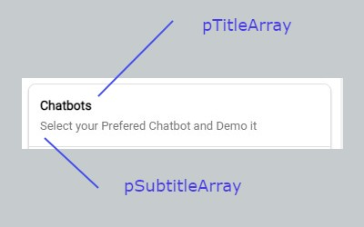
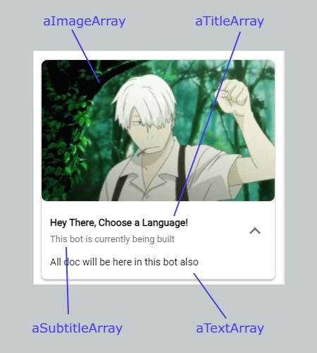
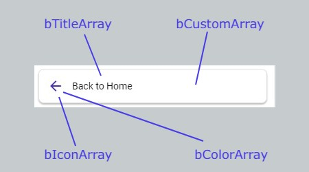
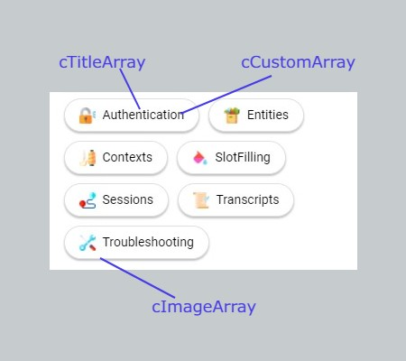
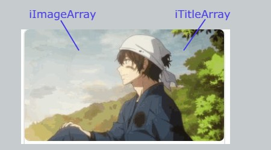
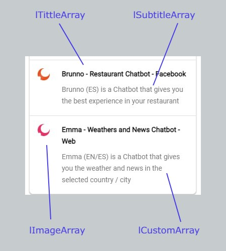
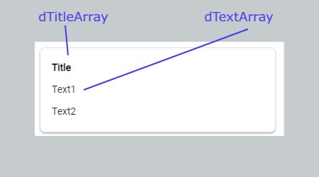

# webBlocks

import Tabs from "@theme/Tabs";
import TabItem from "@theme/TabItem";

WebBlocks are used to build structures with **Dialogflow Messenger**

### webParagraph

**Is used to show a Paragraph**

> - Just a Paragraph



<Tabs>
<TabItem value="php" label="PHP">

```php
$pTitleArray = array("Title1");
$pSubtitleArray = array("Subtitle1");

webParagraph($pTitleArray, $pSubtitleArray);
```

</TabItem>
<TabItem value="nodejs" label="Node.js">

```nodejs
ALPHA
```

</TabItem>
</Tabs>

### webAccordeon

**Is used to display a card**

> - webAccordeon shows a Card with Title, Subtitle and a text inside of a accordeon label.
> - Accordeon Text can have styles with the span function.



<Tabs>
<TabItem value="php" label="PHP">

```php
$aImageArray = array("https://imageurl.com");
$aTitleArray = array("Title");
$aSubitleArray = array("Subtitle");
$aTextArray = array("Subtitle");

webAccordeon($aImageArray, $aTitleArray, $aSubtitleArray, $aTextArray);
```

</TabItem>
<TabItem value="nodejs" label="Node.js">

```nodejs
ALPHA
```

</TabItem>
</Tabs>

### webButton

**Is used to display a Button**

> - Button works in two ways depending if you pass a link (you will get a redirection with target blank) if just text, a Event with this text as name will be triggered.
> - Buttons can be used with a Card
> - Buttons can be stacked indifinetely and you can separate with basicDivider.



<Tabs>
<TabItem value="php" label="PHP">

```php
$bTitleArray = array("Button Title 1", "Buttton with Link 2");
$bCustomArray = array("eventName","https://google.com");
$bIconArray = array("home","arrow_forward");
$bColorArray = array("$red","$blue");

webButton($bTitleArray, $bCustomArray, $bIconArray, $bColorArray);
```

</TabItem>
<TabItem value="nodejs" label="Node.js">

```nodejs
ALPHA
```

</TabItem>
</Tabs>

### webChip

**Displays one title and multiple options to choose**

> - Webchips can work on two different ways depending if you put a link (Will work as an a Hyperlink) if you put a word, this will be the default message outputted if the user press on it.
> - WebChips stacks indefinitely and are separed in a Flexbox way.



<Tabs>
<TabItem value="php" label="PHP">

```php
$cTitleArray = array("Chip Title1","Chips title 2");
$cImageArray = array("https://chipsImageURl.com","https://chipsImageURl.com");
$cCustomArray = array("Chip Text","https://chips.com");

webChips($cTitleArray, $cImageArray, $cCustomArray);
```

</TabItem>
<TabItem value="nodejs" label="Node.js">

```nodejs
ALPHA
```

</TabItem>
</Tabs>

### webImage

**Displays a simple image**

> - Images can be stacked indifinelty, but only one can be used for an Accordeon



<Tabs>
<TabItem value="php" label="PHP">

```php
$iImageArray = array("https://imageurl.com");
$iTextArray = array("Image Alt Text");

webImage($iImageArray, $iTextArray);
```

</TabItem>
<TabItem value="nodejs" label="Node.js">

```nodejs
ALPHA
```

</TabItem>
</Tabs>

### webList

**Displays horizontal Cards**

> - Lists can work as Buttons, if you put a link in their customPart these will work as hyperlink, if just a text, will trigger an Event with that name.



<Tabs>
<TabItem value="php" label="PHP">

```php
$lTitleArray = array("Title list","Title list 2");
$lSubtitleArray = array("Subtitle List","Subtitle list 2");
$lImageArray = array("https://imageurl.com","https://imageurl.com");
$lCustomArray = array("https://hyperlink.com","TextEvent");

webList($lTitleArray, $lSubtitleArray, $lImageArray, $lCustomArray);
```

</TabItem>
<TabItem value="nodejs" label="Node.js">

```nodejs
ALPHA
```

</TabItem>
</Tabs>

### webDescription

**Provides a simple Paragraph with no Styles**

> - A Simple text with lot of Paragraphs
> - Depending of how many text you pass as index you will get separated paragraphs.



<Tabs>
<TabItem value="php" label="PHP">

```php
$dTitleArray = array("Description Title 1","Description title 2");
$dTextArray = array(array("Description Text 1 for title 1","Description Text 2 for title 1"), array("Description Text 1 for title 2","Description Text 2 for title 2"));

webDescription($dTitleArray, $dTextArray);
```

</TabItem>
<TabItem value="nodejs" label="Node.js">

```nodejs
ALPHA
```

</TabItem>
</Tabs>
