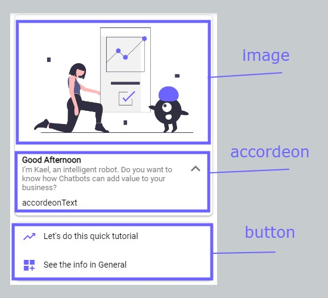

# webTemplates

import Tabs from "@theme/Tabs";
import TabItem from "@theme/TabItem";

WebTemplates are used to build nice structures in a Web Environment. These templates are created to work with Dialogflow Messenger.

## webStructureTemplate

**webStructureTemplate help us to create a custom Structure**

> - You can use whatever block you want but take in mind that you have to separate it with a separator (Choose what best fits to you).
> - In order to make structure work, you can paste all the name's structures inside of structure, and the components required in the component array
> - If you dont know already what to do with context please make it false and just declare contextBody as nothing. (You can find Context in doc)
> - Available webBlocks are **card button reply description image list paragraph** These can be located in blocks -> webBlocks
> - Available separators are **comma basicDivider commaDivider superDivider**

> - You can build a structure with the blocks or use this Structure Template Tool [**HERE**](https://github.com/)

<Tabs>
<TabItem value="php" label="PHP">

```php
$context = false;
$contextBody = [];
$webTitle = ["intentName"];

$imageArray = ["imageurl"];
$aTitleArray = ["Card Title"];
$aSubtitleArray = ["Card Subtitle"];
$aTextArray = ["Card Accordeon Text"];

$bTitleArray = ["Button Title 1","ButtonTitle2"];
$bCustomArray = ["button Custom 1","button Custom 2"];
$bIconArray = ["Button Icon","Button Icon 2"];
$bColorArray = ["#00efff","#000fff"];


$structure = ['image','comma','card','superDivider','button'];
$components = [
    [$imageArray,$webTitle],
    [],
    [$aTitleArray,$aSubtitleArray,$aTextArray],
    [],
    [$bTitleArray,$bCustomArray,$bIconArray,$bColorArray]
];

webStructureTemplate($context, $contextBody, $webTitle, $structure, $components);
```

</TabItem>
</Tabs>

#### Example of Template shown above


